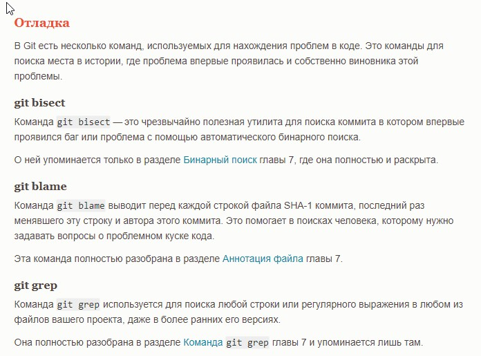

# Руководство по Git.
Приступим к изучению команд.
## Команды Git.
1. init - инициализирует репозиторий.
2. status - показывает состояние репозитория.
3. commit - сделать коммит.
4. log - журнал.
## Ветки
1. branch - менеджер веток.
2. branch "name" - создать ветку.
3. merge "name" - слить ветки.
4. checkout "name" - переключиться на ветку. 
## Шрифт

# Совместная работа и обновление проектов.
1. submodule - используется для управления вложенными репозиторями.
2. push - используется для установления связи с удаленным репозиторием.
3. remote - служит для управления списком удаленных репозиториев.
1. fetch - связывается с удаленным репозиторием и забирает из него все изменения.
4. archive - используется для упаковки в архив указанных коммитов или всего репозитория.
# Осмотр и сравнение.
1. show - отображает проект в простом и человекопонятном виде.
2. shortlog - служит для подведения итогов команды git log.
3. describe - принимает на вход что угодно, что можно трактиковать как коммит (ветку, тег) и выводит более-менее человекочитаемую строку, которая не изменяется в будущем для данного коммита.
## Отладка
1. bisect - это утилита для поиска коммита в котором впервые появился баг или проблема.
2. blame - выводит перд каждой строкой файла SHA-1 коммита, последний раз менявшего эту строку  и автора этого коммита. Это помогает в поисках человека, которому следует задавать вопрлосы о проблемном куске кода.
3. greep- используется для поиска любой строки или регулярного выражения в любом из файлов вашего проекта, даже в более ранних его версиях.

