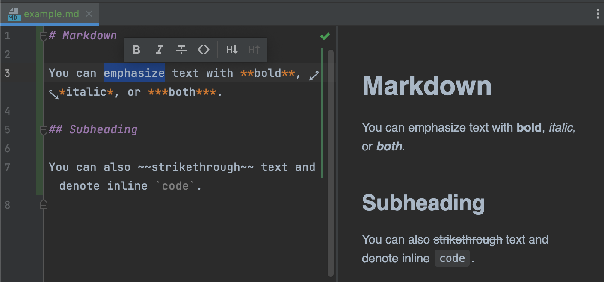

# Руководство по Git.
Приступим к изучению команд.
## Команды Git.
1. init - инициализирует репозиторий.
2. status - показывает состояние репозитория.
3. commit - сделать коммит.
4. log - журнал.
## Ветки
1. branch - менеджер веток.
2. branch "name" - создать ветку.
3. merge "name" - слить ветки.
4. checkout "name" - переключиться на ветку. 
## Шрифт

# Совместная работа и обновление проектов.
1. submodule - используется для управления вложенными репозиторями.
2. push - используется для установления связи с удаленным репозиторием.
3. remote - служит для управления списком удаленных репозиториев.
1. fetch - связывается с удаленным репозиторием и забирает из него все изменения.
4. archive - используется для упаковки в архив указанных коммитов или всего репозитория.
# Осмотр и сравнение.